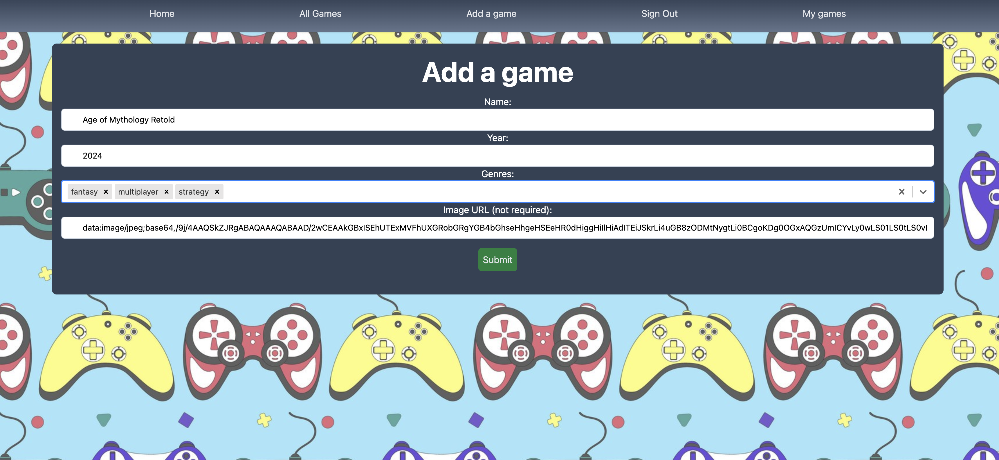
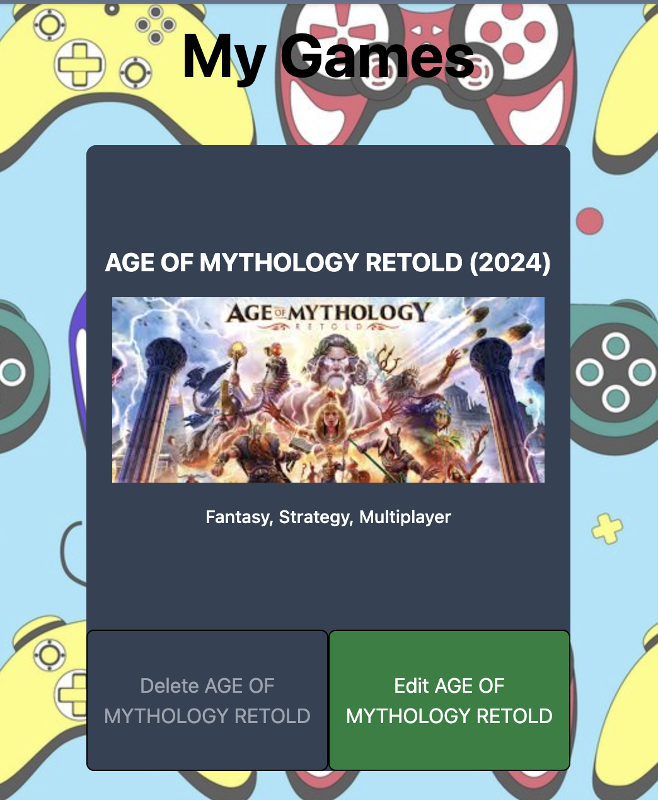

# Joystickipedia


## Description
**This Was a MERN stack group porject during our general assembly bootcamp<br>This is a CRUD aplication that allows users to add their favorite videogames and allows our users to colectivly review and rate the games and interact which each one.**

---

## Deployment Link
-[Deployment Link](https://joystickipedia.netlify.app/)
---
### Brief

- Back end is Express + Node, front end is React.
- Use MongoDB as your database management system.
- Use JWT token-based authentication for users, for both back end and front end.
- Including the user model, have at least three models, with at least one relating to the user.
- Back end and front end have full CRUD functionality.
- Any required secret keys must be obtained from the back end application, and must **not** be accessible fron the front end application.
- Deploy your app online for others to use.

### Code installation

Run `npm i` to install dependencies.

Go to [MongoDB](https://cloud.mongodb.com/) and create a database.

In your back end, create a `.env` file and add the following variables:
```
SECRET_PASSWORD=
MONGODB_URI=
PORT=
```

In your front end, create a `.env` file and add the following variable:
```
VITE_APP_URL=
```
To run the app, run the command `npm run dev` in both your front end and back end.

---
## Timeframe & Working Team (Pair)

This was a 7-day project completed in a pair with both contributors linked below:

[Kieran](https://github.com/KizzaThorley)  
[Tawheed](https://github.com/TawheedAhmed28)  

We planned this project using a Trello board and conducted regular standups and pair coding sessions during points where we felt both contributors' input was needed.<br>  
[Trello Board](https://trello.com/b/3e8WFnCV/tawheed-kieran-project-3)

Tawheed and I decided to pair code the back end of the application to allow both of us to have an understanding of how to implement features end-to-end. For the front end, we worked on different React components to reduce the chances of merge conflicts.

---
## Technologies Used

## Back-end
- JavaScrip
- Node
- MongoDB
- mongoose 
- jwt
- bcrypt
- cors
- netlify
- express 

## Front-end
- JavaScript
- React
- CSS
- HTML
- React Select
- React Toastify
- Tailwindcss
- netlify 

---


## Build/Code Process

```js
import mongoose from "mongoose";
import mongooseUniqueValidator from "mongoose-unique-validator";

const numberMessage = "number needs be between 1 and 5";

const reviewSchema = new mongoose.Schema({
    review: { type: String, required: true, trim: true },
    rating: { type: Number, required: true, min: [1, numberMessage], max: [5, numberMessage] },
    addedBy: { type: mongoose.Schema.ObjectId, ref: "User", required: true },
}, { timestamps: true });

const gameSchema = new mongoose.Schema({
    name: { type: String, required: true, trim: true, unique: [true, "game needs to be unique"] },
    year: { type: Number, required: true, min: [1958, "Your game can't be older than the first game ever"], trim: true },
    genres: [{ type: mongoose.Schema.ObjectId, required: true, ref: "Genre" }],
    imageUrl: { type: String, required: false, trim: true },
    addedBy: { type: mongoose.Schema.ObjectId, ref: "User", required: true },
    reviews: [reviewSchema],
});

gameSchema.plugin(mongooseUniqueValidator);

export default mongoose.model('Game', gameSchema);
```
The schema for our game was one of the pieces I lead the coding the thought process we had was to put as much verification on a models to allow for multiple layers to make sure our saved data fitted the right format. <br>
<br>
The difficulty with this was when we seeded the data. My solution to this problem was:

``` js
Copy code
const genreMap = genres.reduce((acc, genre) => {
    acc[genre.name] = genre._id;
    return acc;
}, {});

gamesData.forEach(game => {
    game.addedBy = user._id;
    const genreNames = gameGenreMapping[game.name] || [];
    game.genres = genreNames.map(name => genreMap[name]).filter(Boolean);
});
```
These two functions allowed us to take the seeded genres data's new IDs and add them into the seeded video games data so that we could have a linked relationship in our database to make different requests later, such as sorting by genres.


---

## Challenges

The biggest challenge, other than learning React, was using the React Select dropdown. The difficulty arose due to the multiple selections that were linked to our genres in the database.

```js
async function getGenres() {
  try {
    const { data } = await axios.get(`${baseUrl}/genres`);
    let genreDataSelect = data.map((genre) => {
      return { value: genre.name, label: genre.name };
    });

    return setGenreData(genreDataSelect);
  } catch (error) {
    console.log(error.response);
    toast.error(error.response.data.message);
  }
}

<Select
  isMulti
  value={formData.genres}
  options={genreData}
  onChange={handleSelectChange}
/>
```
This meant that I had to format the data into the structure required by the Select component by mapping through it and creating an object with a value and a label for the dropdown to use to create the desired genres while still holding their Mongoose ID.

```js

async function getGame() {
  try {
    const { data } = await axios.get(`${baseUrl}/games/${gameId}`);
    const newFormData = structuredClone(formData);
    newFormData.name = data.name;
    newFormData.year = data.year;
    newFormData.imageUrl = data.imageUrl;
    newFormData.genres = data.genres.map((genre) => {
      return { value: genre.name, label: genre.name };
    });

    return setFormData(newFormData);
  } catch (error) {
    toast.error(error.response.data.message);
  }
}

function handleSelectChange(e) {
  const newFormData = structuredClone(formData);
  newFormData.genres = e;

  setFormData(newFormData);
}
```
During the edit phase, the genres needed to be added for the user, creating a third dataset that moved in state, so that the React dropdown and form were linked.

```js
async function onFormSubmit(e) {
  e.preventDefault();
  try {
    const newFormData = structuredClone(formData);
    let genresArray = newFormData.genres.map((genre) => {
      return genre.value;
    });
    newFormData.genres = genresArray;

    const token = localStorage.getItem('token');
    await axios.post(`${baseUrl}/games`, newFormData, {
      headers: { Authorization: `Bearer ${token}` },
    });

    navigate('/my-games');
  } catch (error) {
    toast.error(error.response.data.message);
  }
}
```
This process was topped off by having to map through the genres again to reformat them for saving to the database, which allowed our users to add multiple genres to each game—a desired feature from the start.





---

## Key Learnings/Takeaways
This project was my first time doing pair programming, which also introduced me to handling merge conflicts and working with GitHub repositories. I had the opportunity to practice my communication skills to ensure smooth collaboration with Tawheed. Whenever conflicts arose, we would discuss and resolve them together. Additionally, I felt that working together helped lessen problems, as talking through them allowed us to come up with two potential solutions and refine a better one.<br>

During this project, I realized the importance of good coding practices and how they made each other's code much more readable, which allowed for smoother collaboration.<br>

Additionally, my confidence in creating more complex relational data and schemas through the seeding process improved. My understanding of how to plan, build, and account for features from the start also helped the process immensely.


### Bugs

As of the time I write this README, I haven't found any bugs.

---
## Future Improvements
- Make the site mobile friendly most pages currently are except for individual show page.

- adding a dark mode in the future.
