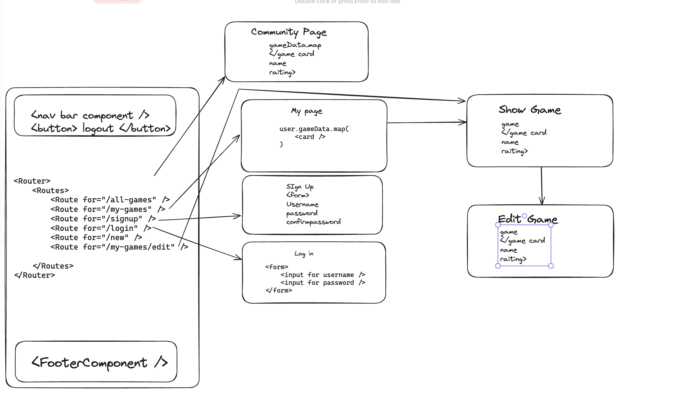
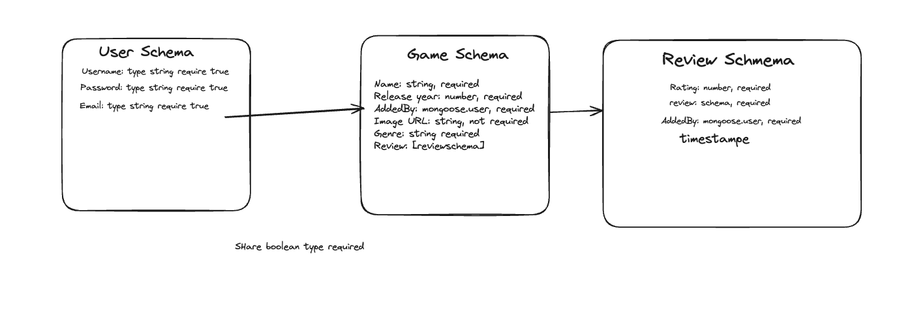
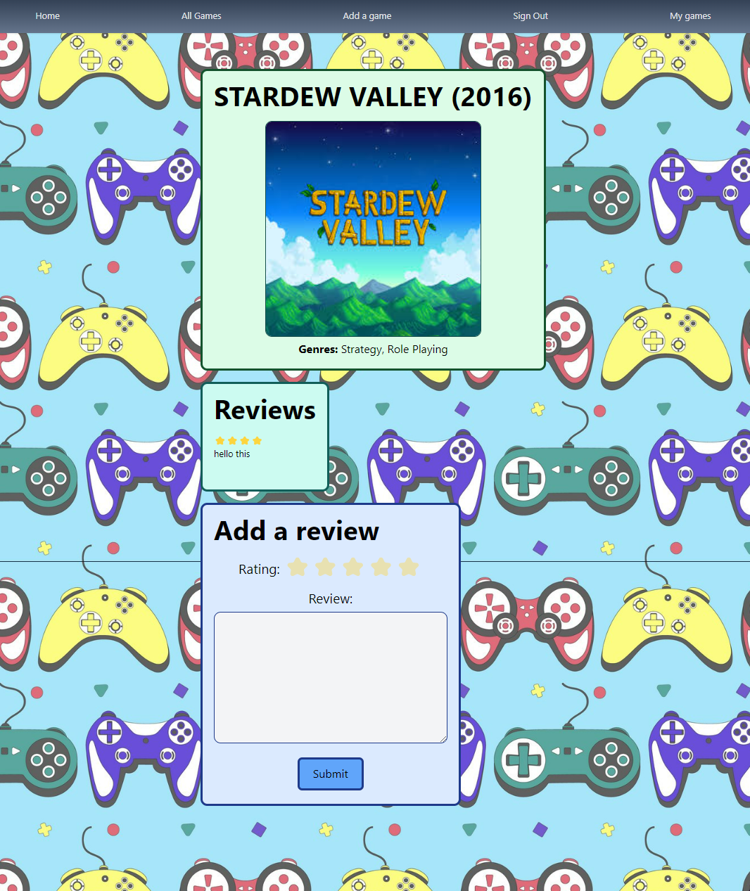
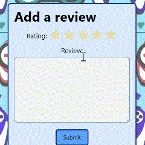

# Joystickipedia - deployed link [here](https://joystickipedia.netlify.app/)

#### Paired project with [Kieran Thorley](https://github.com/KizzaThorley) - MERN stack app with full CRUD functionality, made within a week. Users can add their own games, as well as leave reviews on their own or others' games.

### Technologies used

#### Front end:
- JSX
- React
- CSS (Tailwind)
- HTML
- React Select
- React Toastify

#### Back end:
- JavaScript
- Node
- Mongoose
- MongoDB
- jwt
- bcrypt
- Express


### Brief

To create a MERN stack app with CRUD functionality, on a topic of our choosing, with at least three data models relating to one another. Kieran and I decided on a theme of games.

---

### Code installation

Go to [MongoDB](https://cloud.mongodb.com/) and create a database.

In your back end, create a `.env` file and add the following variables:
```
SECRET_PASSWORD=
MONGODB_URI=
PORT=
```

In your front end, create a `.env` file and add the following variable:
```
VITE_APP_URL=
```
To run the app, run the command `npm run dev` in both your front end and back end.

---

### Planning

We put together a **Trello** board (located [here](https://trello.com/invite/b/666b0562fcdb23ab5be0d263/ATTI21637e64cdd78a096cb2109aa3082983F739526B/tawheed-kieran-project-3)) in order to delegate tasks to one another and to easily balance workload.

We used **Excalidraw** to sketch both our wireframe and our ERD:





Kieran and I planned to pair programme the back end, and split front end views evenly. Kieran focused mainly on pages for all games and authentication, and I focused on the "show" page for individual games, as it included reviews as well as game details.

---

### Build process

We pair programmed the back end for the most part. When it was my turn to write out the code, I leaned towards working on authentication and secure routes.

```js
// gamereview-project-backend/middleware/secureRoute.js

import { secret } from "../config/environment.js";
import { Unauthorized } from "../lib/errors.js";
import jwt from "jsonwebtoken"
import User from "../models/user.js";

export default async function secureRoute(req, res, next) {
try {
    const rawToken = req.headers.authorization

    if(!rawToken) {
        throw new Unauthorized()
    }
    const token = rawToken.replace('Bearer ', '')

    const payload = jwt.verify(token, secret)

    const user = await User.findById(payload._id)

    if (!user) {
        throw new Unauthorized()
    }
res.locals.currentUser = user

next()

} catch (error) {
    next(error)
}

}
```

The secure route works in tandem with our custom error handling middleware to lock down any routes requiring a user to be logged in.

Onto authentication itself - again, using our custom errors:

```js
// gamereview-project-backend/controllers/auth.js
if (req.body.password !== req.body.passwordConfirmation) {
    throw new PasswordsNotMatching()
}
```

---

After this, I moved onto the front end, more specifically the individual game page. Most of my time during this project was spent on this page as it proved to be a much harder task than originally anticipated - as well as game details, there were user specific features and reviews to implement.



Obtaining the information for each game wasn't difficult, as each game was populated - I had all info to hand, I just had to format it properly for the user.

```jsx
const [game, setGame] = React.useState(null)
async function getGame() {
    try {
        const { data } = await axios.get(`{baseUrl}/games/${gameId}`)
        setGame(data)
    } catch (error) {
        toast.error(error)
    }
}

// --------------------------------------------

<h1 className='text-center font-bold text-5xl mb-5 uppercase'>{game.name} ({game.year})</h1>
<div className="object-center flex justify-center">
    {game.imageUrl && (
        
    )}
</div>

// ---------------------------------------------

<p className='capitalize text-xl'>
    <span className='font-bold'>Genres: </span>
    {game.genres.map((genre, index) => (
        index === game.genres.length - 1 ? (
            <span key={index}>{genre.name}</span>
        ) : (
            <span key={index}>{genre.name}, </span>
        )
    ))}
</p>
```

I then implemented reviews, starting with referring back to the review schema:

```js
const numberMessage = "number needs be between 1 and 5"

const reviewSchema = new mongoose.Schema({

    review: { type: String, required: true, trim: true, },
    rating: { type: Number, required: true, min: [1, numberMessage], max: [5, numberMessage] },
    addedBy: { type: mongoose.Schema.ObjectId, ref: "User", required: true, },
},
    { timestamps: true })
```



---

### Challenges

Getting the stars to correlate to numerical ratings was a pain. I could easily have had numbers from 1 to  5 for ratings but I really wanted to get a star system working. The first step of making this work was to add a numerical value for rating **into state**:

```jsx
  const [review, setReview] = React.useState({
    review: "",
    rating: 0,
    addedBy: ""
  })
```

After this, I would need a row of five stars, to which we head to our component `ReviewCard.jsx`:

```jsx
<label htmlFor='rating' className='text-2xl'>Rating: </label>
{[1, 2, 3, 4, 5].map((num) => (
    <input
        type='button'
        name='rating'
        id={num.toString()}
        value="⭐"
        required
        className='cursor-pointer text-4xl opacity-40'
        key={num}
        onClick={changeRating}
    />
```

And back to `SingleGame.jsx`:

```jsx
  function changeRating(event) {
    const newReview = structuredClone(review)
    newReview.rating = Number(event.target.id)
    setReview(newReview)

    for (let i = 5; i > 0; i--) {
      const button = document.getElementById(i)
      button.classList.add("opacity-40")
    }
    for (let i = event.target.id; i > 0; i--) {
      const button = document.getElementById(i)
      button.classList.remove("opacity-40")
    }
  }
```

Without the `for` loops here, the rating system worked just fine, but that wasn't what I was going for - I could have implemented any old rating system if it was! I wanted the user to be able to see stars become opaque to show their rating, and that's where Tailwind came in handy. Changing the star emojis' CSS properties was as simple as toggling opacity classes.

Adding back the `opacity-40` class every time a star was clicked was necessary, as otherwise, when a user would choose a higher rating and then a lower rating, the fully opaque stars would stay opaque, and a user would see a 2 star rating, for example, as a 4 star rating.

---

### Key learnings

This was my first experience with pair programming, and in turn, merge conflicts and pulling GitHub repositories. I got to practice communication skills here to make sure I never conflicted with Kieran, and if I did, we would talk through it together and work something out. The experience was fascinating for me, as I find it interesting to see how others would solve a coding problem, whether that be to pinch ideas, or to reassure myself that my methods are good!

Also, as lame as it sounds, this project taught me that it pays to be neat with your file structure. Splitting everything into components made my life much easier when it came to spotting broken bits of code, and before this project, I was quite a messy programmer. 

I now find myself going out of my way to make my work neater, because when something inevitably goes wrong, you'll take whatever you can get in terms of speeding up a debugging process!

### Bugs

As of the time I write this README, I haven't come across any bugs, but if I find some, I'll be sure to either fix them or update this section.

### Future improvements

- Since reviews have numerical ratings, I'd like to add an average rating for each game.

- Add half-star ratings (e.g. 4.5 stars) for more precise scores.

- Make the site mobile friendly. Right now, some game pages distort the other elements.

- The general theme of the site is quite bright and vibrant, so it may be worth adding a dark mode in the future.

## Enjoy the app! <3